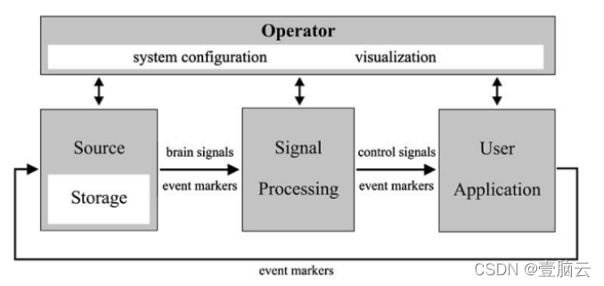

# BCI2000
BCI2000是基于C++语言的脑—机接口平台，由四个模块组成：源（数据采集与储存）、信号处理、用户应用和操作员界面。这些模块通过基于TCP/IP的文档化网络功能协议进行通信。因此，每一个模块都可以用任何编程语言编写，并且可以在网络上的任何机器上运行。

（1）模块
源模块数字化和存储大脑信号，并将它们传递下去，而不需要任何进一步的预处理来处理信号，由数据采集和数据存储组件组成。数据存储将获取到的脑信号样本连同所有相关系统变量（如系统参数或所有当前事件标记）存储在数据文件中。记录的文件格式由一个ASCII标头组成，然后是二进制信号样本和事件标记值。文件格式可以容纳任意数量的信号通道、信号参数或事件标记。

信号处理模块将来自大脑的信号转换为控制输出设备的信号。这种转换有两个阶段：特征提取和特征翻译。在第一阶段，从源模块接收数字化信号，例如皮层神经元的放电速率或诱发电位的幅度等。在第二阶段，一种转换算法将这些信号特征转换为发送给用户应用模块的控制信号。信号处理的两个阶段中的每一个阶段都由信号算子的级联组成，每个算子将输入信号转换为输出信号。单个信号算子（如空间滤波器、时间滤波器或线性滤波器）彼此独立，因此可以在不影响他人的情况下组合或互换，尽可能地得到想要的特征信号，并提高信噪比。

用户应用模块接收来自信号处理的控制信号，并使用它们驱动应用程序。在BCI2000中，用户应用程序是在计算机屏幕上直观地显示的，包括目标、字母或图标的选择，用户反馈可能是听觉或触觉。这说明了BCI2000系统是一个通用型的系统，而并不是只针对于某一种环境或者某一种要求下的定制型系统。

（2）系统变量

BCI2000包含三种类型的系统变量：参数、事件标记和信号。系统参数是在整个数据文件中，即在特定的在线操作期间不改变的那些变量。相比之下，事件标记记录在操作期间发生的事件，这些事件可以从一个数据样本变化到下一个数据样本。每个模块都可以访问这些事件标记，并且可以修改或简单地监控它们。每个模块可以请求操作员模块创建任意数量的系统参数（不同数据类型，如数字、向量、矩阵或字符串）或事件标记（每个长度为1-16位）。例如，源模块可能需要一个定义信号采样率的参数。该参数在某个规定的在线运行期间保持不变，并可用于所有其他模块。类似地，信号处理模块可以请求事件标记器来标记信号中的伪像，例如由肌肉运动产生的伪像。

（3）信号处理

信号处理模块，这里也是不管哪个BCI系统中最重要最复杂的模块。

信号处理的第一阶段，特征提取，从数字化的脑信号中提取特征。特征提取一般由一系列三个信号算子组成。

第一信号算子是执行输入矩阵（即样本块）的线性变换的校准例程，以便将输入信号（即a/D单位的值矩阵）转换为以微伏为单位的输出信号。

第二信号算子是执行线性变换（即，与校准模块的输出的权重的矩阵乘法）的空间滤波器，使得每个输出信道是所有输入信道的线性组合。该信号算子可容纳任何线性空间滤波器操作（例如拉普拉斯推导或共同平均、独立分量或共同空间模式）。

第三个信号算子是时间滤波器。迄今为止，已经实现了五种变体：慢波滤波器、5个自回归谱估计、有限脉冲响应滤波器、从神经元动作电位提取放电率的峰值检测例程和平均诱发反应（如P300）的滤波器。

信号处理的第二阶段，即转换算法，将信号特征转换为控制信号，供用户应用程序使用，一般都由两个信号运算符组成。

第一信号算子是执行线性变换（即，分类矩阵与时间滤波模块的输出的矩阵乘法）的分类器，使得每个输出信道是所有输入信道的线性组合。例如，当时间滤波器的输出是功率谱时，分类器可以在将定义的信道和频率乘以指定的权重后将它们相加。

转换算法中的第二个信号算子是一个规格化器，它对每个输出信道执行线性变换，以创建具有零平均值和特定值范围的信号。归一化器的输出是信号处理模块的输出。

对于BCI2000的某些实现，此过程需要有关用户应用程序模块（记录在事件标记中）的当前状态的信息。为了尽量减少这一要求所需的模块相互依赖性，BCI2000允许研究者定义计算基线的时间段，而不是将这些信息硬编码到软件中。即不是通过编写相关的软件代码将信号处理和用户应用模块显式地捆绑在一起，而是将此职责分配给操作员（他必须通过菜单输入此信息）。因此，用户应用模块中的改变要求信号处理模块仅被重新配置而不是重写。

将信号处理分解为一系列信号算子，提供了高度的互换性和独立性。例如，从产生功率谱的时间滤波器到产生平均诱发反应的时间滤波器的改变不需要在下一阶段进行任何改变，即线性分类器。因此，当前的实现可以很容易地适应各种不同的信号处理方法，并且其他方法（例如那些使用非线性分类器的方法）可以用最小的努力实现
