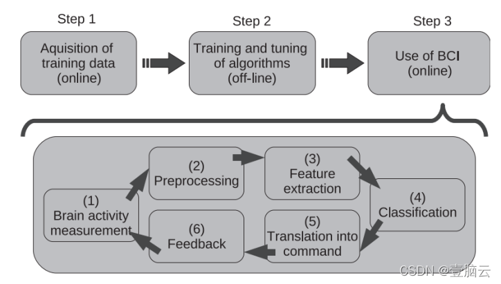
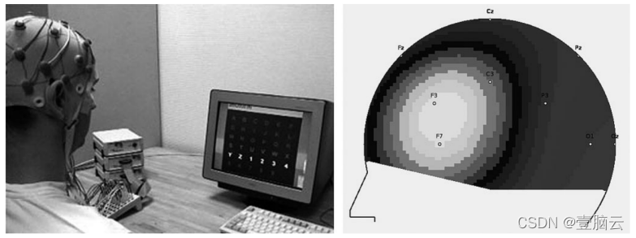

# OpenViBE介绍
OpenViBE是一个开源软件平台，用于脑机接口系统的设计、测试和使用，并将它们与真实和虚拟环境相连接。该平台由一组软件模块组成，可以轻松有效地集成这些模块，从而为真实和虚拟现实应用设计BCI。该平台的主要特点是：模块化和可重用性，适用于不同类型的用户，可移植性，以及与虚拟现实的连接。
* 模块化和可重用性
**OpenViBE平台是一款软件模块化的平台，专门用于脑电数据的采集、预处理和可视化，以及与虚拟现实的交互**。而且OpenViBE作为通用软件，用户能够容易地添加新的软件模块来实现需求。
* 适用于不同类型的用户
OpenViBE是为不同类型的用户设计的：其中包括医生，虚拟现实开发人员，以及神经科学研究员等等。根据编程能力和对大脑的了解不同，他们所需要的功能也不同，所需要的的工具也不同。
* 可移植性
**平台独立于不同软硬件设备运行，允许与各种输入设备一起运行**，例如EEG或MEG。OpenViBE可以在Windows和Linux系统上运行，并且还提供了不同的数据可视化技术，搭载了例如GTK（Gnome ToolKit是一个高度可用、功能丰富的工具包，用于创建图形用户界面，具有跨平台兼容性，并提供了一个易于使用的API）,IT++（IT++是一个包含数学、信号处理和通信例程的C++库）,GSL（一个面向C和C++程序员的数字图书馆），VRPN（虚拟现实外围网络是一个库中的一组类，用于实现应用程序和虚拟现实系统中使用的一组物理设备之间的接口），GCC（一个支持多种架构的编译器）等工具库。
* 与虚拟现实的连接
OpenViBE可以与VR应用集成，充当真实世界和虚拟环境的外围设备，并且允许用户以可理解的方式可视化大脑活动或提供激励性训练环境（例如，用于神经反馈）。

## BCI实验设计

在BCI，人们习惯于想象几种不同的用例以及相应的角色。他们是作者、操作员和用户。不同角色的人对系统的不同方面感兴趣。作者是从硬件和软件组件构建BCI系统的设计师。在作者组装了该系统之后，它可以用于应用控制或实验。作者使用可视化场景编辑器来排列现有的框，形成一个场景，配置这些盒子和场景，以产生一个完整的、随时可用的BCI系统。

操作员负责使用和运行作者预先构建的场景，然后简单地运行该场景。操作员知道BCI系统应该如何工作，并通过专用的可视化工具监测BCI系统的执行，帮助用户增强对BCI系统的控制。BCI用户通常佩戴大脑活动采集硬件例如脑电帽，并通过精神活动与应用程序交互。理想情况下，BCI软件应使操作员的角色尽可能小。

通常设计BCI需要三个不同的步骤。**第一步中，在执行特定脑力任务的被试者上采集训练数据，第二步是对这些数据进行离线分析，最后一步是在闭环流程中在线使用BCI。可以对数据采集和离线训练进行多次迭代，以便改进参数。第三步包括：大脑活动测量、预处理、特征提取、分类、译码和反馈。**
1. 大脑活动测量
这一步包括测量BCI用户的大脑活动，测量BCI系统的脑活动主要使用EEG来执行。
2. 预处理
预处理主要是在采集到的信号中**去除噪声**和**增强特定的大脑信号**，例如可使用不同种类的预处理算法，如时间滤波器和空间滤波器（独立主成分分析和表面拉普拉斯）
3. 特征提取
信号经过预处理之后就可以提取特征了。这些特征由几个值组成，描述了嵌入信号中的相关信息，例如特定频带中信号的功率。OpenViBE中可提取的特征包括**频带功率特性或功率谱密度**。
4. 分类
特征向量被输入到一种**分类器的算法**中。分类器给每个特征向量分配一个类别，这个类别是已经被识别的脑信号的标识符。通常，使用来自每个类别的一组特征向量预先训练分类器。用于BCI的分类器的一个例子是线性判别分析（LDA）。
5. 译码
一旦识别出信号的类别，就可以将其与发送到计算机的命令相关联，以便控制机器人或假肢。在当前基于EEG的BCI系统中，可能的命令数量通常在1到4之间变化。
6. 反馈
当执行完以上步骤后，应该向用户提供反馈，以便用户可以确定大脑信号是否被正确执行。这是一个重要步骤，有助于用户控制大脑活动。反馈可以是简单的视觉或听觉提示，或者可以提供更高级的反馈，例如修改OpenViBE向其发送命令的虚拟环境。

### 工具

系统包括了各种有用的工具：**采集服务器，设计器，2D可视化工具，以及BCI或神经反馈的示例场景**。采集服务器为各种采集机器提供了通用接口，例如EEG和MEG系统。由于使用了通用的采集盒，这允许作者创建独立于硬件的场景。该采集盒通过网络从采集服务器接收数据，采集服务器实际上连接到硬件，并以通用方式转换这些数据。采集服务器连接到设备的方式主要取决于硬件制造商访问设备的方式。一些设备将附带特定的SDK，一些设备将提供com网络上的通信协议。最后，一些设备需要特定的采集软件，将测量值传送到采集服务器。

设计器主要面向作者，使作者能够使用专用的图形语言和简单的图形用户界面(GUI)基于现有的软件模块构建完整的场景，如下图所示。作者可以访问面板中现有模块的列表，并可以在场景窗口中拖放它们。每个模块显示为一个矩形框，带有输入(顶部)和输出(底部)。双击一个框会显示其配置面板。盒子可以通过它们的输入和输出进行人工连接。设计者还允许作者配置可视化窗口的排列(即，场景中包括的可视化模块)。

2D可视化功能可作为特定的盒子使用，包括大脑活动相关的可视化。这些盒子可以访问所有的平台功能，在设计和运行BCI时，查看数据以发现潜在问题是很常见的。诸如EEG中电极连接不良之类的问题可以通过硬件提供的阻抗检查来揭示，而诸如干扰噪声之类的其他问题可能只有在一些适当的可视化中才能清楚。可视化数据的另一个原因是深入了解如何改进信号处理。在不同种类的转换之后查看数据，以查看信号是否如预期的那样改变，以及所遇到的问题是否已经减轻。出于这些原因，平台提供了可视化工具。

建议使用现有的和预配置的现成场景来帮助作者。随着新场景的创建变得越来越快、越来越容易，可用场景的数量预计会迅速增加。目前，有五个完整的场景可用。基于手部运动想象的BCI:这个场景允许使用OpenViBE作为交互环境，使用想象的左右手运动。P300拼写器:这个场景实现了著名的P300拼写器使用户能够只使用大脑活动拼写字母。

左:P300拼写器。右图:头皮上大脑活动的实时2D可视化。
