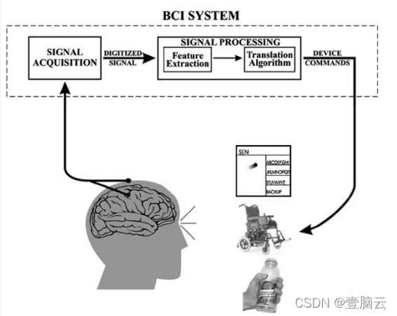

# BCI软件平台介绍
脑-机接口能够实现大脑与外界设备的直接通讯。构建一套完整的脑-机接口系统既需要硬件平台也需要软件平台。其中，软件平台涉及刺激呈现、数据读取与预处理、数据分析与解码、在线反馈等多个环节。通用的脑—机交互系统大致由四个模块组成：信号采集模块、信号处理模块、控制器模块和反馈模块。

（1）信号采集模块
脑信号的采集可以采用有创的植入电极方法，也可以采用无创的头皮脑电、功能磁共振成像或者近红外光谱等方法。

（2）信号处理模块
主要包含特征提取和模式识别两个部分。特征提取即找到一种更有效的方法来表达信号中的特征成分，目的是要为进一步的模式分类提供依据。模式识别是对信号进行处理和分析，以便后续进一步地辨认、分类和解释。

（3）控制器模块
控制器模块是将模式分类得到的结果转换成相应的控制命令以实现用户的真实意图，例如移动鼠标或者控制轮椅等。

（4）反馈模块
反馈模块是将被控制对象的状态通过人体的感知系统传递给大脑。现有的基于EEG的脑—机接口系统根据所检测到的电生理信号的不同主要分为以下三类：运动想象脑—机接口、P300脑—机接口和稳态视觉诱发电位（SSVEP）脑—机接口。目前脑—机接口设计主要在软件层面实现，它能与目前常用的脑信号采集设备相连，完成信号采集工作，并在此基础上提供常用脑—机交互实验范式的信号处理软件，并将解读后的脑信号转换成相应的控制命令以实现对外部设备的控制。

目前已公开的脑机接口相关软件工具包从应用角度可分为以下几类：第一是用于设计实验任务、构建刺激程序的工具包，主要包括PsychoPy、E-Prime等。第二是用于实现采集设备软硬件联通的工具包。其中，BCI2000软件是一种脑-机接口系统基础研发平台，NeuroScan是与采集硬件配套的集成可编程软件；第三是专精于后期信号处理分析的工具包，包括熟知的EEGLAB、MNE等。

### 参考链接
https://blog.csdn.net/zyb228/article/details/128017357
脑机接口综合性开源软件平台MetaBCI功能介绍及获取方式

https://blog.csdn.net/weixin_40052256/article/details/123532583
解析热点脑机接口平台

