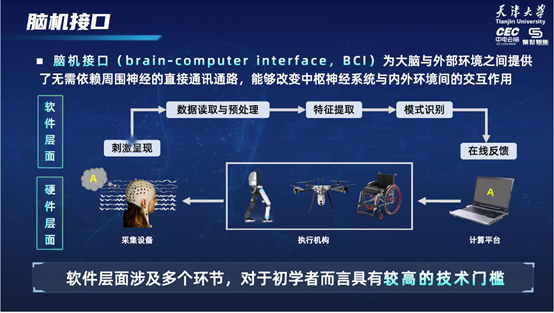
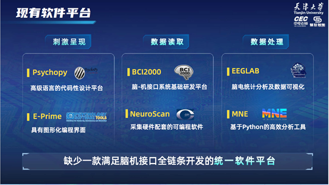
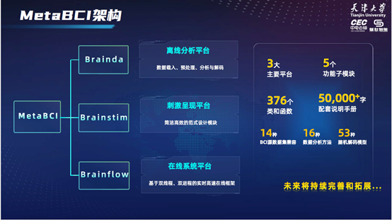

# [脑机接口综合性开源软件平台MetaBCI功能介绍及获取方式](https://blog.csdn.net/zyb228/article/details/128017357)
欢迎来到脑机接口综合性开源软件平台MetaBCI的发布会现场，我是来自天津大学的许敏鹏。
脑-机接口能够实现大脑与外界设备的直接通讯。**构建一套完整的脑-机接口系统既需要硬件平台也需要软件平台。其中，软件平台涉及刺激呈现、数据读取与预处理、数据分析与解码、在线反馈等多个环节**，对于非专业人士和初学者而言具有较高的技术门槛。

目前已公开的脑机接口相关软件工具包从应用角度可分为以下几类：
> **第一是用于设计实验任务、构建刺激程序的工具包**，主要包括PsychoPy、E-Prime等。
> **第二是用于实现采集设备软硬件联通的工具包**。其中，BCI2000软件是一种脑-机接口系统基础研发平台，NeuroScan是与采集硬件配套的集成可编程软件
> **第三是专精于后期信号处理分析的工具包**，包括熟知的EEGLAB、MNE等。尽管这些成熟的软件工具包在功能、性能方面各有千秋，但是它们大多只面向某一个单独环节，因此，通常需要多软件配合使用才能构建出一套完整实用的脑-机接口系统。当前，缺少一款满足脑机接口全链条开发的统一软件平台。

基于以上背景，为降低构建脑-机接口系统的技术门槛，减少研发成本，促进转化落地，我们团队打造了一款**脑机接口领域的综合性开源软件平台MetaBCI**。针对BCI领域数据分布散乱、算法复现困难、在线系统效率低的问题，MetaBCI规范了BCI数据结构与预处理流程、开发了通用的解码算法框架、利用双进程和双线程提高在线系统实时效率，由此提供了面向BCI软件层面全链条开发的解决方案。MetaBCI基于全球开源的高级语言python开发，代码托管至Github公有仓库，配套使用说明手册，并且提供技术支持。

MetaBCI包括Brainda、Brainstim和Brainflow三大部分。面向离线分析需求，Brainda统一了现有公开数据集接口，优化了脑电数据读取与处理流程，复现多种主要BCI数据分析及解码算法，以此提高研究者的算法开发效率；面向刺激呈现需求，Brainstim提供了简洁高效的范式设计模块，可快速创建脑机接口范式刺激界面；面向在线开发需求，Brainflow利用双线程、双进程编程方法实现了实时高速的数据读取、数据处理、结果反馈等功能，帮助开发者轻松搭建脑机接口在线实验系统。截止目前，MetaBCI共包含软件代码376个类和函数，配套中文说明手册5万余字，兼容14种BCI公开数据集，涵盖16种数据分析方法和53种脑机解码模型。未来，我们还将持续完善并拓展MetaBCI的功能。

近年来，脑机接口领域出现了大量的公开数据集和先进的分析与解码算法。然而，这些公开数据集缺少统一的标准，数据格式复杂多样。此外，不同的数据分析与解码算法大多采用不同的语言实现，其处理流程、交叉验证方式也不尽相同。这些问题限制了脑机接口从业人员的开发效率。为此，面向离线分析需求，Brainda平台囊括了数据载入与预处理、数据分析、解码算法三大子模块。

其中，数据载入与预处理子模块统一了现有公开数据集接口，规范了各公开数据集的读取格式，并设计了可外部定制化操作的数据预处理流程。首先，创建了可拓展的数据集基类，实现了多种通讯协议下的数据集自动下载，将不同类型的数据集以一种简洁、高效的方式转化为一致的数据结构；其次，规范了预处理流程，将其划分为原始数据Raw处理阶段、分段数据Epoch处理阶段和试次数据Data处理阶段，并在这三个处理阶段均添加了可外部设置的hook函数来实现定制化预处理操作。Brainda平台实现了兼具规范性和灵活性的数据载入与预处理流程，统一了BCI数据格式，能够显著提高后续数据分析与解码的效率。

数据分析子模块集成了全面、多样化的特征分析方法，可以对脑电信号的时域特征、频域特征和时频特征进行快速分析。其中，时域分析主要根据脑电信号的时域波形特点，来提取信号的幅值、相位、潜伏期等时域信息；频域分析主要利用频谱变换来分析信号的频谱分布规律和频率成分差异；时频分析通过对输入信号进行时频分解，以提供时间域与频率域的联合分布信息。

最后，Brainda平台的解码算法模块以先进的机器学习库Sklearn为标准，规范了BCI解码算法调用接口，实现了一个通用的解码算法框架。其中，fit函数利用训练数据进行建模，transform函数利用已有模型将输入数据转换为相应特征，predict函数用于预测新数据的标签。截止目前，Brainda平台移植了53种先进脑机解码算法以及专业智能计算模型，按照数学方法类型分为四个主要部分，包括30种矩阵分解算法、5种深度学习模型、3种迁移学习算法以及6种黎曼几何算法。同时独立出了一些重要的通用数据处理方法和多种常用的交叉验证方法。总体而言，Brainda解码算法模块兼顾了算法调用的通用性和灵活性，用一套代码即可调用多种算法。

不同脑机接口范式的任务需求、刺激形式都各不相同，作为MetaBCI的第二大部分，Brainstim平台为最常用的三大BCI实验范式分别量身定制了可靠的高性能实现方案。其中，SSVEP范式内置了标准频-相联合编码功能；ERP范式内置了标准行/列闪烁功能；MI范式内置了标准左右上肢运动想象任务功能。

除了集成多种常规BCI范式之外，Brainstim平台还为用户提供了丰富的自定义设置选项，实现了主流BCI范式的一键部署与高度自由化设计。按照程序功能，Brainstim主要分为通用流程控制、刺激界面设计以及数据标签传输三大子模块。首先，通用流程控制模块帮助实验人员初始化程序界面、确立实验整体框架；其次是刺激范式设计模块，包含拼写键盘、几何图案、音频视频等多种刺激界面，支持对目标指令的数目、大小、形状、颜色、角度、刺激形式等十余种属性进行设置；最后，数据传输通讯模块允许用户定义事件标签的类型与功能，同时根据硬件设备的不同，提供串口、并口两种通讯手段。

最后是MetaBCI的在线系统搭建框架—Brainflow平台。该平台主要包含三大子模块，日志记录模块负责记录整个工作过程的日志信息；在线控制模块为主进程，其下又包含两个线程，分别负责脑电采集设备的控制以及在线数据的截取；数据处理模块为子进程，可实现对离线数据的建模和对在线数据的实时解码。程序运行时，首先与采集设备建立通讯连接并发出开始指令，此时含有标签信息的脑电数据被传入到主进程中；然后，主进程下的数据截取线程会根据标签和时间窗截取试次数据，并将数据传递给数据处理模块；最后，数据处理模块识别解码结果并反馈给刺激界面。由此，通过双进程及双线程的方式有效增强了系统运行效率、加快了程序响应速度、提高了资源利用率。Brainflow平台可兼容多种脑电采集设备，可直接调用Brainda中的解码算法进行在线识别。

MetaBCI代码已在GitHub公开共享，可以访问链接免费下载。另外，我们还有配套的中文使用手册，欢迎发邮件免费领取。

